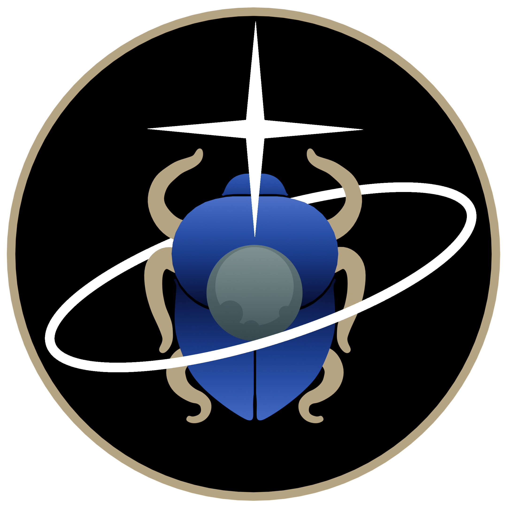

<!-- SPDX-FileCopyrightText: 2026 Orbital Research Cluster for Celestial Applications (ORCCA) Lab, University of Colorado at Boulder -->
<!-- SPDX-License-Identifier: ISC -->
<div align="center">
  &nbsp;&nbsp;&nbsp;
  &nbsp;&nbsp;&nbsp;
  
</div>

<h1 align="center">Scarabaeus</h1>

<p align="center">
  <b>Open-source spacecraft navigation & orbit determination framework</b><br>
  Developed by the <a href="https://www.colorado.edu/aerospace/research/research-areas/space-exploration/orcca">Orbital Research Cluster for Celestial Applications (ORCCA)</a><br>
  Colorado Center for Astrodynamics Research (CCAR) · University of Colorado Boulder
</p>

<p align="center">
  <a href="https://ccar-orcca.github.io/scarabaeus-docs/"></a>
  <a href="LICENSE"></a>
  
  
  
</p>

---

## Overview

**Scarabaeus (SCB)** is a Python framework for spacecraft navigation and orbit determination (OD). It provides a unified, mission-agnostic environment for:

- Building and propagating spacecraft trajectories with multiple force models
- Simulating or ingesting radiometric and optical measurements
- Running sequential and batch OD filters (SRIF, LKF, LSB, …)
- Estimating dynamical, measurement, and consider parameters
- Performing maneuver planning and finite/impulsive burn modelling

SCB interfaces with [NASA SPICE](https://naif.jpl.nasa.gov/naif/toolkit.html) for time, frame, and kernel management and ships a compiled **Rust** back-end for performance-critical integrators.

---

## Table of Contents

1. [Features](#features)
2. [Architecture](#architecture)
3. [Requirements](#requirements)
4. [Installation](#installation)
   - [User Installation](#user-installation)
   - [Developer Installation](#developer-installation)
5. [Quick Start](#quick-start)
6. [Tutorials](#tutorials)
7. [Testing](#testing)
8. [Contributing](#contributing)
9. [Citing Scarabaeus](#citing-scarabaeus)
10. [License](#license)

---

## Features

### Dynamics & Force Models
| Class | Description |
|---|---|
| `PointMassGravity` | Two-body (Keplerian) gravitational acceleration |
| `ThreeBodyGravity` | Third-body perturbation via SPICE ephemeris |
| `SphericalHarmonicsGravity` | Gravity field up to arbitrary degree/order |
| `CannonballSRP` | Solar radiation pressure (cannonball model) |
| `nPlateSRP` | Solar radiation pressure (N-plate model with CK-frame solar arrays) |
| `YarkovskyEffect` | Yarkovsky non-gravitational force |
| `FirstOrderGaussMarkov` | First-order Gauss–Markov stochastic accelerations |
| `PiecewiseFirstOrderGaussMarkov` | Piecewise Gauss–Markov accelerations |
| `ImpulsiveBurn` | Instantaneous delta-v manoeuvres |
| `FiniteBurn` | Continuous thrust finite burn arcs |

### Integrators
| Class | Description |
|---|---|
| `IAS15` *(Rust)* | Implicit adaptive 15th-order integrator (Rein & Spiegel 2015) |
| `DOP853` | Dormand–Prince 8(5,3) via SciPy |

### Measurement Models
| Class | Type |
|---|---|
| `RangeIdeal` | Two-way range (ideal/simulated) |
| `RangeRateIdeal` | Two-way range rate (ideal/simulated) |
| `DopplerIdeal` | Doppler range rate (ideal/simulated) |
| `DopplerReal` | Doppler from real DSN tracking data |
| `SequentialRangingReal` | Sequential ranging from real DSN tracking data |
| `DiffOneWayRangeIdeal` | Differential one-way range (DDOR) |
| `AngularIdeal` | Right ascension / declination optical measurements |
| `CentroidingIdeal` | Pixel-plane centroiding measurements |

### Orbit Determination
| Class | Description |
|---|---|
| `SRIF` | Square Root Information Filter (forward pass) |
| `SRIFB` | Square Root Information Filter (smoother / backward pass) |
| `LKF` | Linearised Kalman Filter |
| `LSB` | Least-squares batch estimator |
| `MultiFilterOD` | Multi-arc OD over disjoint data windows |
| `MeasurementEditing` | Outlier detection and data editing |
| `StateNoiseCompensation` | SNC process noise formulation |
| `DynamicalModelCompensation` | DMC process noise formulation |

### Spacecraft & Environment
- `Spacecraft`, `CelestialBody`, `GroundStation` body hierarchy
- `nPlateModel` — N-plate geometry with static and CK-frame (rotating) panels
- `Camera`, `Antenna` instrument classes
- `MissionSequence` — chained propagation / manoeuvre / OD arcs
- `Trajectory` — post-processing and visualisation of propagated states
- `Propagator` — configurable propagator wrapping any force model

### Utilities
- `ArrayWUnits` / `Units` — dimension-safe arithmetic with full unit tracking
- `ArrayWFrame` — arrays with attached reference frames
- `EpochArray` — time object supporting UTC, TDB, TT, SCLK conversions
- `SpiceManager` — unified SPICE wrapper (kernels, frames, ephemeris queries)
- `OrbitalElements` — Cartesian ↔ Keplerian conversions
- `Bplane` — B-plane targeting utilities
- `Plotting` — styled matplotlib helpers
- `DatabaseManager` — local / MongoDB data back-end

---

## Architecture

```
scarabaeus/
├── src/
│   ├── scarabaeus/               # Python front-end
│   │   ├── body/                 # Body, CelestialBody, GroundStation
│   │   ├── dynamics/             # Force models and burn models
│   │   ├── environment/          # Propagator, StateArray, Trajectory, MissionSequence
│   │   ├── finiteBurn/           # Maneuver, ManeuverParser
│   │   ├── guidance/             # B-plane targeting
│   │   ├── measurements/         # Measurement model classes
│   │   ├── orbitDetermination/   # Filter classes (SRIF, LKF, LSB, …)
│   │   ├── spacecraft/           # Spacecraft, Instrument, Camera, Antenna, nPlateModel
│   │   ├── timeAndFrame/         # EpochArray, Frame, ArrayWFrame, SpiceManager
│   │   ├── uncertaintyQuantification/
│   │   ├── units/                # Units, Dimensions, ArrayWUnits
│   │   └── utils/                # Plotting, OrbitalElements, DatabaseManager, Utils
│   └── scarabaeus_rust/          # Rust back-end (compiled via maturin / PyO3)
│       └── src/
│           ├── ias15.rs          # IAS15 integrator
│           ├── integration_event.rs
│           └── lib.rs
├── tutorials/                    # Worked examples (basics → advanced)
├── tests/                        # pytest test suite
├── docs/                         # Sphinx documentation source
├── pyproject.toml
├── DEVELOPMENT.md
└── LICENSE
```

---

## Requirements

| Dependency | Version | Notes |
|---|---|---|
| Python | 3.11+ | |
| Rust / Cargo | 1.75+ | developer build only |
| NumPy | latest | |
| SciPy | latest | |
| SpiceyPy | latest | SPICE toolkit Python bindings |
| matplotlib | latest | |
| pandas | latest | |
| scikit-learn | latest | |
| trimesh | latest | mesh geometry (N-plate model) |
| autograd | latest | automatic differentiation |
| tqdm | latest | progress bars |
| pymongo / ssh\_pymongo | latest | optional MongoDB data back-end |
| ipykernel / ipympl | latest | Jupyter notebook support |

> **pip version** — the developer install uses `--group dev` syntax, which requires **pip ≥ 25**. Run `pip install --upgrade pip` if you encounter an error.

Full dependency list is in [`pyproject.toml`](pyproject.toml).

---

## Installation

### User Installation

#### 1. Clone the repository

```bash
git clone https://github.com/ccar-orcca/scarabaeus.git
cd scarabaeus
```

#### 2. Create a virtual environment

```bash
python -m venv .venv
# macOS / Linux
source .venv/bin/activate
# Windows
.venv\Scripts\activate
```

#### 3. Install Scarabaeus

```bash
pip install .
```

Or, once the package is published on PyPI:

```bash
pip install scarabaeus
```

> **SPICE kernels** — SCB relies on SPICE kernels for ephemeris, frame, and spacecraft clock data. These are not distributed with the package. Load them in your script using `scb.SpiceManager.load_kernel_from_mkfile(path_to_metakernel)`.

---

### Developer Installation

> See [DEVELOPMENT.md](DEVELOPMENT.md) for the full guide. The summary is below.

#### 1. Follow the user installation steps above

#### 2. Install the developer extras

```bash
pip install -e . --group dev
```

#### 3. Install Rust

Follow the [rustup installer](https://rustup.rs/) instructions, then verify:

```bash
rustc --version
```

#### 4. Build the Rust back-end

```bash
maturin develop
```

This compiles the Rust code and binds it to the Python package. Re-run whenever Rust source files change.

#### 5. Install commit hooks

```bash
pre-commit install
```

This installs `nbstripout` and other hooks that run before each commit.

---

## Tutorials

A tiered tutorial suite lives in [`tutorials/`](tutorials/) as Jupyter Notebooks (`.ipynb`).

### Basics
| Tutorial | Description |
|---|---|
| [`basics_AWU_and_AWF.ipynb`](tutorials/basics_AWU_and_AWF.ipynb) | `ArrayWUnits` and `ArrayWFrame` — dimension-safe arithmetic and frame-attached arrays |
| [`basics_EpochArray.ipynb`](tutorials/basics_EpochArray.ipynb) | Time representations and conversions (UTC, TDB, TT, SCLK) |
| [`basics_SpiceManager_and_CelestialBodies.ipynb`](tutorials/basics_SpiceManager_and_CelestialBodies.ipynb) | Loading SPICE kernels, time/frame queries, and defining celestial bodies |

### Intermediate
| Tutorial | Description |
|---|---|
| [`intermediate_Propagator_and_Trajectory.ipynb`](tutorials/intermediate_Propagator_and_Trajectory.ipynb) | Propagator configuration with multiple force models; trajectory post-processing |
| [`intermediate_MissionSequence_and_FiniteBurn.ipynb`](tutorials/intermediate_MissionSequence_and_FiniteBurn.ipynb) | Mission sequence with chained propagation arcs and finite burns |
| [`intermediate_Measurements.ipynb`](tutorials/intermediate_Measurements.ipynb) | Simulating and computing radiometric and optical measurements |
| [`intermediate_nPlateModel_and_Attitude.ipynb`](tutorials/intermediate_nPlateModel_and_Attitude.ipynb) | N-plate SRP model with CK-frame rotating panels and spacecraft attitude |
| [`intermediate_BPlane.ipynb`](tutorials/intermediate_BPlane.ipynb) | B-plane targeting — OSIRIS-REx 2017 Earth gravity assist example |

### Advanced
| Tutorial | Description |
|---|---|
| [`advanced_IdealMSR_BatchOD.ipynb`](tutorials/advanced_IdealMSR_BatchOD.ipynb) | End-to-end batch OD (LSB, SRIFB) with simulated measurements, process noise, and measurement editing |
| [`advanced_IdealMSR_SequentialOD.ipynb`](tutorials/advanced_IdealMSR_SequentialOD.ipynb) | Sequential OD (LKF, SRIF, RTS smoother) with SNC/DMC process noise and consider parameters |
| [`advanced_RealMSR_MediaCorrections.ipynb`](tutorials/advanced_RealMSR_MediaCorrections.ipynb) | OSIRIS-REx Pt 2 — tropospheric/ionospheric media corrections and DSN ramp table management |
| [`advanced_RealMSR_OSIRIS_REx_OD.ipynb`](tutorials/advanced_RealMSR_OSIRIS_REx_OD.ipynb) | OSIRIS-REx OD with real DSN radiometric tracking data |

---

## Testing

Scarabaeus ships a multi-tier pytest suite under [`tests/`](tests/):

```bash
pytest tests/unit_testing/        # fast, isolated unit tests
pytest tests/integration_testing/ # end-to-end scenarios
pytest                            # full suite with coverage report
```

Coverage and JUnit XML reports are written to `tests/reports/`.

---

## Contributing

Contributions are welcome. Please read [CONTRIBUTING.md](CONTRIBUTING.md) and the [developer guide](https://ccar-orcca.github.io/scarabaeus-docs/dev_guide/dev_guide_frontpage.html) before opening a pull request.

### Reporting issues

Open a GitHub Issue and include: a short title, steps to reproduce (minimal working example preferred), expected vs. actual behaviour, and your Scarabaeus version, Python version, and OS. For security vulnerabilities, contact the maintainers directly.

### Submitting code

1. Set up the [developer environment](#developer-installation).
2. Branch from `develop` with a descriptive name, e.g. `feature/add-xyz` or `fix/filter-bug`.
3. Follow the **NumPy docstring convention** for all public API.
4. Run the test suite and ensure all tests pass: `pytest`.
5. Open a PR against the `develop` branch with a clear description of what changed and why. Reference related Issues (e.g. `Closes #42`).

> Jupyter notebook outputs are stripped automatically by the `nbstripout` pre-commit hook — do not commit notebooks with cell outputs.

---

## Citing Scarabaeus

If you use Scarabaeus in academic work, please cite it as:

```bibtex
@software{scarabaeus2026,
  author       = {ORCCA Lab, University of Colorado Boulder},
  title        = {Scarabaeus: Open-source spacecraft navigation \& orbit determination framework},
  year         = {2026},
  version      = {2026.0.0},
  url          = {https://ccar-orcca.github.io/scarabaeus-docs/},
  license      = {ISC},
}
```

---

## License

Scarabaeus is distributed under the [ISC License](LICENSE).

Copyright (c) 2026 CCAR-ORCCA, University of Colorado Boulder.
