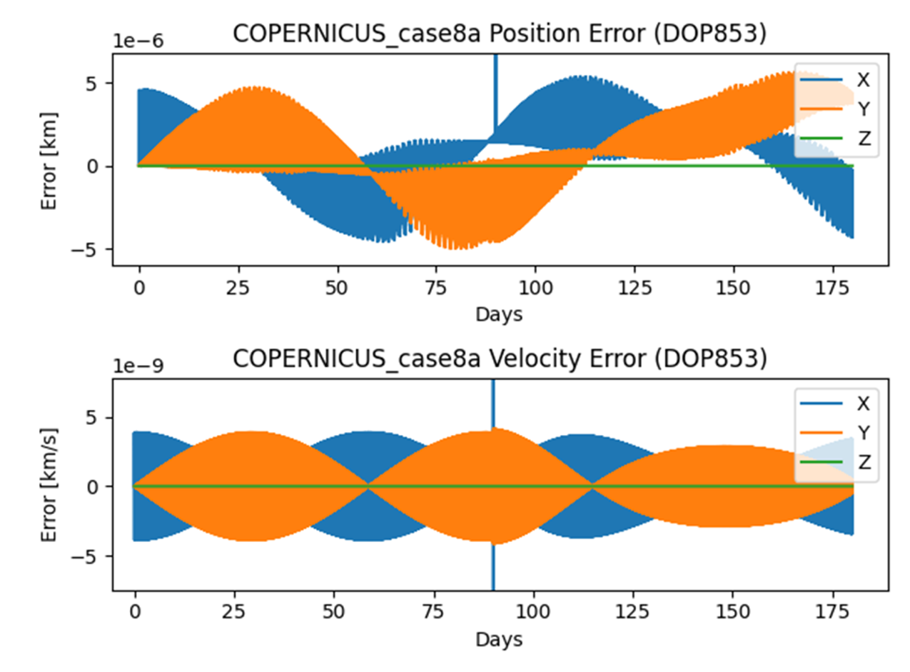

# Summary

Scarabaeus (SCB) is an open-source spacecraft orbit determination (OD) package developed by the Orbital Research Cluster for Celestial Applications (ORCCA) at the University of Colorado Boulder. A modular, object-oriented Python front end and a hybrid Python-Rust back end for intensive computations form a complete end-to-end navigation environment. SCB provides high-fidelity trajectory propagation with configurable dynamical models; simulation, ingestion, and processing of radiometric measurements (two-way coherent Doppler, sequential ranging, range, and range-rate) and optical measurements (center-finding and landmark observations); and comprehensive estimation spanning batch and sequential filtering, consider and stochastic parameters, multi-arc estimation, square-root information filters and smoothers, and multiple process noise formulations. NASA's SPICE toolkit [@acton1996] supplies mission-grade time systems, reference frames, and ephemerides.

Development is primarily motivated by the Emirates Mission to the Asteroid Belt (EMA) [@parker2024ema], whose MBR Explorer spacecraft launches in 2028 for six main belt asteroid flybys before rendezvous with asteroid (269) Justitia. SCB therefore emphasizes interplanetary navigation and small-body proximity operations, yet its modular architecture and broad measurement support suit many other navigation problems, including cislunar missions; GNSS measurement types and atmospheric drag are not yet implemented but can be rapidly developed, making Earth-orbiting extension straightforward.

# Statement of Need

Spacecraft navigation poses a complex estimation problem spanning nearly every aspect of astrodynamics: high-fidelity propagation must capture gravitational and non-gravitational perturbations, heterogeneous tracking data must be modeled and processed with comparable fidelity, and OD algorithms must iteratively estimate the spacecraft state, dynamical and measurement model parameters, and associated uncertainties, producing statistically consistent estimates and covariance information.

The state of the art is well established: mature, comprehensive tools include MONTE [@monte2018], GEODYN [@nicholas2025geodyn], ODTK [@vallado2010odtk], Tudat [@gisolfi2025tudat], and GODOT [@godot]. Many other tools target specific mission classes or organizations rather than general-purpose, mission-agnostic use, and among major publicly available systems only Tudat is fully open source — highlighting the need for more community-developed, openly accessible navigation software.

SCB contributes a comprehensive OD framework combining research flexibility with the robustness real missions need. Driven by EMA requirements, it is continuously exercised against realistic operational scenarios. Its audience is the astrodynamics research community and mission teams seeking a flexible, transparent, extensible open-source platform for navigation analysis.

# State of the Field

Among open-source OD frameworks, the most comprehensive alternative is **Tudat** [@gisolfi2025tudat], a mature astrodynamics and estimation toolkit with a C++ core and Python interface (TudatPy) that now supports radiometric tracking data analysis. SCB is a complementary effort, developed natively in Python and Rust and driven by an active deep-space mission's operational requirements.

While both provide high-fidelity dynamical modeling and estimation, SCB emphasizes the day-to-day needs of navigation and flight dynamics teams. Beyond OD itself, it offers measurement editing and solution quality control, B-plane mapping and targeting, database-backed mission infrastructure supporting multiple simultaneous operators, and maneuver design with local optimization of finite burns — a coherent environment for the full workflow, from data processing and state estimation to operational analysis and trajectory design. SCB also currently offers a broader OD framework: sequential filtering architectures, process noise modeling, and multi-leg and multi-arc estimation.

Rather than reimplement general numerical infrastructure, SCB builds on mature open-source tools: SpiceyPy [@annex2020spiceypy] for geometry, reference frames, and ephemerides; SciPy [@virtanen2020scipy] and PyASA [@rein2015ias15] for numerical methods and high-accuracy propagation; MongoDB [@mongodb] and PyMongo [@pymongo] for data management; Sphinx [@sphinx] for documentation; and Pytest [@pytest] for testing and verification.

These capabilities support both operational navigation and scientific investigations, from precise OD to radio science analyses.

# Software Design

**Architecture and design principles.** SCB's object-oriented Python front end exposes user-facing classes and scripting interfaces, while Python and Rust back-end components handle performance-critical tasks: numerical propagation, dynamical model evaluation, and estimation. Four design principles guide the codebase: modularity through clear class responsibilities; *contextualization* — each datum is owned by a specific object and traceable throughout its lifecycle; *unit typing* — physical units attach to quantities via `ArrayWUnits` and propagate through computations; and *frame awareness* — vectors carry explicit frame and origin information via `ArrayWFrame`. SCB also reuses mature open-source libraries where possible. Unit and frame awareness matter especially in navigation, where subtle inconsistencies carry major operational consequences — notably the Mars Climate Orbiter loss, traced to a metric-imperial mismatch in ground trajectory software [@mco1999]. Explicitly attaching units, frames, and origins to numerical quantities reduces such risks and improves navigation-analysis transparency and safety.

**Dynamical models.** SCB implements point-mass and N-body gravity, spherical-harmonic gravity, cannonball and N-plate solar radiation pressure, impulsive and finite-burn maneuvers, and stochastic accelerations via piecewise first-order Gauss-Markov processes; these models and their partial derivatives have been validated against other state-of-the-art tools [@williams2025copernicus]. Future releases will emphasize additional small-body dynamical environments (e.g., coupled binary-asteroid systems). Every model also supplies partial derivatives for the variational equations used in OD.

**Measurement models.** SCB supports (1) ideal range, range-rate, and differential one-way ranging (DOR) measurements; (2) operational two-way coherent Doppler and sequential ranging observables; and (3) optical measurements in sample/line coordinates or right ascension and declination, for center-finding and landmark-based observations. SCB thus ingests and processes real Doppler and sequential ranging data; operational Delta-DOR support is under active development. Radiometric observables follow Moyer's formulations [@moyer2000], with round-trip light times computed iteratively from SPICE-based station and spacecraft states, accounting for relativistic light-time corrections, antenna and transponder delays, solar corona path delays, and time system conversions; tropospheric and ionospheric effects are applied as measurement corrections. Real tracking data are preprocessed by the Deep Whale Network (DWN), a companion ORCCA Python library that parses TRK-2-34 Tracking and Navigation Files via PyTrk234 [@pytrk234] into standardized JSON, preserving original observables and appending metadata such as SPICE station identifiers and outlier flags.

**Filtering framework.** Four estimators are implemented: a linearized Kalman filter, a least-squares batch estimator, and sequential and batch square-root information filters [@bierman1977], with smoothing for both sequential formulations. Estimable quantities include spacecraft states, many dynamical and measurement model parameters, and consider parameters. For process uncertainty, sequential filters offer State Noise Compensation (SNC) and Dynamical Model Compensation (DMC), while batch estimators handle stochastic parameters via piecewise empirical accelerations. Measurement editing between filter iterations uses interactive lasso selection, statistical editing via residual consistency tests, or user-defined data ranges. All solutions map to arbitrary epochs and frames and export for downstream analysis; multi-leg and multi-arc estimation is supported.

**Testing.** Scarabaeus uses Pytest for its test suite: unit tests (small per-class/function tests isolating low-level issues), integration tests (verifying data passing and class interactions), and functional tests (full-scale, end-to-end checks of the entire tool). These run on every merge alongside a performance check guarding computational efficiency. New classes or functions receive unit tests, plus integration and functional tests when necessary.

**Documentation.** Documentation spans docstrings and an online site built with Sphinx, Jupyter Notebooks, and .rst files. Docstrings follow the Scarabaeus style guide, giving a standardized codebase-wide format that integrates with the Sphinx documentation auto-generated for all classes. The site also hosts tutorials as Jupyter Notebooks and further guides and articles as .rst files.

# Research Impact Statement

SCB directly supports EMA [@parker2024ema], led by the UAE Space Agency, and is designed
to process the mission's radiometric and optical-navigation measurements across all
flight phases. Its dynamical models and partial derivatives were validated against
the state-of-the-art high-fidelity propagator Copernicus [@williams2025copernicus] across
over a dozen test cases with varied dynamical combinations;
\autoref{fig:copernicus} shows a representative comparison for Case 8, a Sun-centered
two-body problem with an impulsive maneuver.

Measurement and filtering implementations were exercised on real and
simulated data in three validation cases [@mcmahon2026issfd]: (i) two-way sequential
ranging and Doppler from OSIRIS-REx DSN passes (DSS-35, Canberra, July 2018), processed
against the publicly archived reference trajectory; (ii) Emirates Mars Mission (EMM)
tracking arcs from multiple DSN stations; and (iii) a fully simulated asteroid
flyby jointly estimating the spacecraft state and two trajectory-correction maneuvers
from combined radiometric and optical data. In each case, post-fit residuals are
centered and statistically consistent with the assigned measurement noise
(\autoref{fig:residuals}), indicating systematic effects are absorbed into the
estimated parameters.

SCB has been presented in several conference proceedings [@mcmahon2026issfd]. The
software already suits interplanetary navigation well; future development targets
improved small-body proximity-operations models — new terrain-relative navigation
observables, asteroid-specific parameter estimation, enhanced multi-arc filtering, and,
potentially, binary-asteroid support — plus real Delta-DOR measurements using quasar
references and finite-burn targeting capabilities, both already under development
[@kuleib2026maneuver].

# AI Usage Disclosure

Scarabaeus' core implementation, algorithms, and architectural design were developed by
the authors. Generative AI assisted with code refactoring and generating unit and
integration tests. The paper was drafted by the authors and revised with AI assistance
for JOSS-format restructuring and language editing. All technical content, examples, and
claims reflect the authors' work and judgment.

# Acknowledgements

Funding for the co-development of the Emirates Mission to Explore the Asteroid Belt is provided
by the United Arab Emirates Space Agency to its knowledge partner, the University of Colorado
Boulder’s Laboratory for Atmospheric and Space Physics. The authors thank past members of the ORCCA
laboratory who contributed to earlier versions of the codebase: Ms. Annalise Cabra, Dr. Anivid
Faura-Pedros, Mr. Kian Shakerin, Dr. Chloe Long, Dr. Dahlia Baker, Dr. Matthew Givens, Dr. Spencer Boone,
Mr. Santhosh Pattamudu-Manoharan, and Mr. Lars Hinüber.

# References
